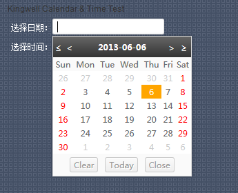
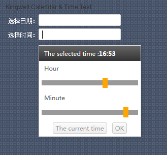
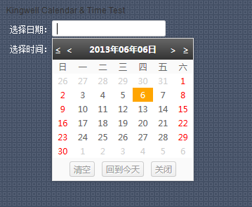
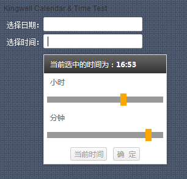

# kingwell Calendar V1.0 日历时间组件 #

> 项目中经常要使用日历时间插件，网上也有很多很优秀的插件，但是我还是喜欢使用自己写的东西，第一比较符合自己项目需要，第二，维护，修改比较内容，第三，代码也比较少，第四，兼容各主流浏览器(IE6,7,8,9,10,FF,Chrome,Opera等)。最近写了个日历与时间选择插件，支持中英文

## 实例 ##

	//日期选择-使用方法
	new Calendar('test1', {
		top : 5,
		language : 'cn',
		addClass : 'Calendar-ui'
	});
	//时间选择-使用方法
	new Time('test2', {
		top : 5,
		language : 'cn'
	});
	

## 效果图 ##

